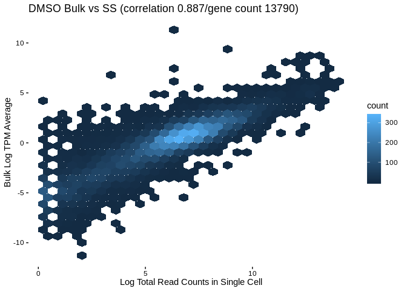
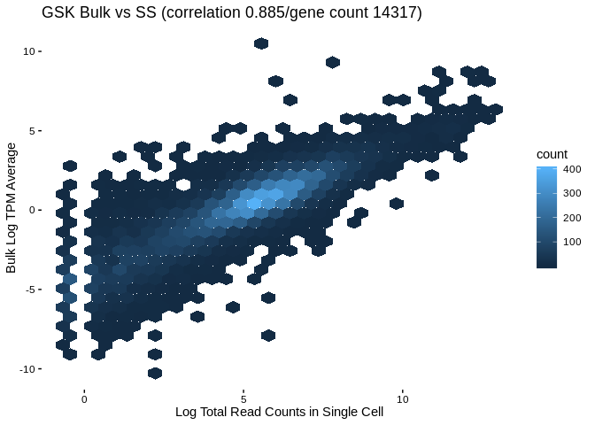

SC Comparison to Bulk
================
Matthew Berginski

Read In Data
============

``` r
tic();
processed_data_file = here('processed_data/genes_with_reads.rds')

all_data_filtered = read_rds(here('processed_data/genes_with_reads.rds'));

#Toss out the other two treatments for now
all_data_filtered = all_data_filtered %>%
  filter(treatment %in% c("DMSO","GSK"))

toc();
```

    ## 9.29 sec elapsed

``` r
ENST_to_HGNC = read.csv(here('processed_data/bulk_processed_data/ENST_to_HGNC.csv'))

bulk_data = rbind(
  read.delim(here('processed_data/bulk_processed_data/SUM159_DMSO_24h_replicate1.fastq.gz/quant.sf')) %>%
    mutate(treatment = "DMSO",rep_num = 1),
  read.delim(here('processed_data/bulk_processed_data/SUM159_DMSO_24h_replicate2.fastq.gz/quant.sf')) %>%
    mutate(treatment = "DMSO",rep_num = 2),
  read.delim(here('processed_data/bulk_processed_data/SUM159_DMSO_24h_replicate3.fastq.gz/quant.sf')) %>%
    mutate(treatment = "DMSO",rep_num = 3),
  read.delim(here('processed_data/bulk_processed_data/SUM159_100nM_trametinib_24h_replicate1.fastq.gz/quant.sf')) %>%
    mutate(treatment = "GSK",rep_num = 1),
  read.delim(here('processed_data/bulk_processed_data/SUM159_100nM_trametinib_24h_replicate2.fastq.gz/quant.sf')) %>%
    mutate(treatment = "GSK",rep_num = 2),
  read.delim(here('processed_data/bulk_processed_data/SUM159_100nM_trametinib_24h_replicate3.fastq.gz/quant.sf')) %>%
    mutate(treatment = "GSK",rep_num = 3)
) %>% left_join(ENST_to_HGNC,by=c('Name'='ensembl_transcript_id_version'))
```

    ## Warning: Column `Name`/`ensembl_transcript_id_version` joining factors with
    ## different levels, coercing to character vector

``` r
bulk_data$treatment = as.factor(bulk_data$treatment)

bulk_summary = bulk_data %>%
  group_by(hgnc_symbol,treatment) %>%
  summarise(TPM_average = mean(TPM))
```

Filter and Combine Bulk/Single Cell
===================================

``` r
# bulk_summary_DMSO = bulk_summary %>% filter(treatment == "DMSO")
# bulk_summary_GSK = bulk_summary %>% filter(treatment == "GSK")

ss_seq_summary = all_data_filtered %>%
  group_by(gene_name,treatment) %>%
  summarise(total_read_counts = sum(count_normed)) %>%
  rename(hgnc_symbol = gene_name) %>%
  left_join(bulk_summary) %>%
  filter(!is.na(total_read_counts), !is.na(TPM_average),
         total_read_counts > 0,
         TPM_average > 0)
```

    ## Joining, by = c("hgnc_symbol", "treatment")

    ## Warning: Column `hgnc_symbol` joining factors with different levels,
    ## coercing to character vector

    ## Warning: Column `treatment` joining factors with different levels, coercing
    ## to character vector

Comparison Plots
================

``` r
DMSO_comparison = ss_seq_summary %>%
  filter(treatment == "DMSO")

DMSO_cor = round(cor(log(DMSO_comparison$total_read_counts),log(DMSO_comparison$TPM_average)),3)
ggplot(DMSO_comparison,aes(x=log(total_read_counts),y=log(TPM_average))) + 
  geom_hex() +
  labs(x="Log Total Read Counts in Single Cell",y="Bulk Log TPM Average") +
  ggtitle(paste0('DMSO Bulk vs SS (correlation ',DMSO_cor,'/gene count ',dim(DMSO_comparison)[1], ')')) +
  BerginskiRMisc::theme_berginski()
```



``` r
GSK_comparison = ss_seq_summary %>%
  filter(treatment == "GSK")

GSK_cor = round(cor(log(GSK_comparison$total_read_counts),log(GSK_comparison$TPM_average)),3)
ggplot(GSK_comparison,aes(x=log(total_read_counts),y=log(TPM_average))) + 
  geom_hex() +
  labs(x="Log Total Read Counts in Single Cell",y="Bulk Log TPM Average") +
  ggtitle(paste0('GSK Bulk vs SS (correlation ',GSK_cor,'/gene count ',dim(GSK_comparison)[1], ')')) +
  BerginskiRMisc::theme_berginski()
```


