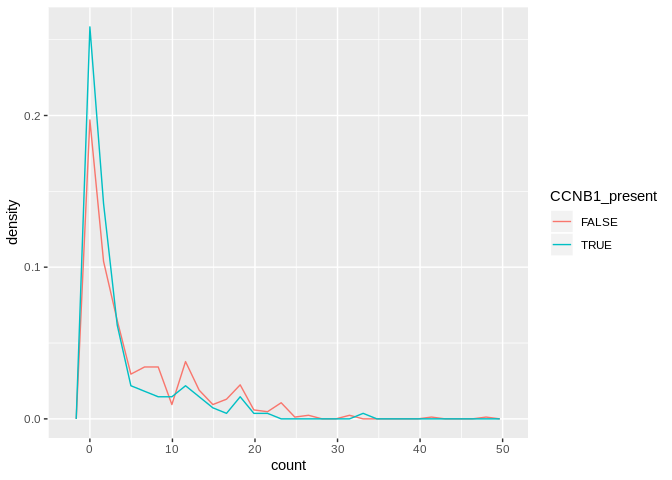

Kinase Inhibitor Single Cell Analysis
================
Matthew Berginski

Read In Data
============

``` r
all_data = rbind(
  read.delim(here('raw_data/matrix_DMSO_2.txt.gz')) %>%
    rename(gene_name = X) %>% 
    gather("cell_id","count",-gene_name) %>%
    mutate(treatment = "DMSO"),
  
  read.delim(here('raw_data/matrix_JQ1_2.txt.gz')) %>%
    rename(gene_name = X) %>%
    gather("cell_id","count",-gene_name) %>%
    mutate(treatment = "JQ1"),
  
  read.delim(here('raw_data/matrix_TRAMET_2.txt.gz')) %>%
    rename(gene_name = X) %>%
    gather("cell_id","count",-gene_name) %>%
    mutate(treatment = "GSK"),
  
  read.delim(here('raw_data/matrix_COMBO_2.txt.gz')) %>%
    rename(gene_name = X) %>%
    gather("cell_id","count",-gene_name) %>%
    mutate(treatment = "combo")
)

all_data$treatment = as.factor(all_data$treatment)
all_data$cell_id = as.factor(all_data$cell_id)
```

``` r
genes_with_reads = all_data %>%
  group_by(gene_name) %>%
  summarise(total_reads = sum(count)) %>%
  filter(total_reads > 0)

CCNB1_present = all_data %>%
  filter(gene_name == "CCNB1") %>%
  group_by(cell_id) %>%
  summarise(CCNB1_present = ifelse(count > 0, TRUE, FALSE))

all_data_filtered = all_data %>% 
  filter(gene_name %in% genes_with_reads$gene_name) %>%
  left_join(CCNB1_present)
```

    ## Joining, by = "cell_id"

``` r
test_for_gene_diffs_wilcox <- function(this_data_set) {
  return(tidy(wilcox.test(count ~ CCNB1_present, this_data_set))$p.value)
}

test_for_gene_diffs_t_test <- function(this_data_set) {
  return(tidy(t.test(count ~ CCNB1_present, this_data_set))$p.value)
}

tic()
# pb <- progress_estimated(length(unique(all_data_filtered$gene_name))*length(unique(all_data_filtered$treatment)))
CCNB1_comparison = all_data_filtered %>%
  group_by(gene_name,treatment) %>%
  nest(count,CCNB1_present) %>%
  mutate(p_val_wilcox = map(data, test_for_gene_diffs_wilcox),
         p_val_t_test = map(data, test_for_gene_diffs_t_test)) %>%
  select(-data) %>%
  unnest(p_val_wilcox,p_val_t_test)
toc()
```

    ## 540.982 sec elapsed

``` r
CCNB1_comparison$p_val_t_test_adjust = p.adjust(CCNB1_comparison$p_val_t_test,method = "fdr")
CCNB1_comparison$p_val_wilcox_adjust = p.adjust(CCNB1_comparison$p_val_wilcox,method = "fdr")
```

``` r
num_diff = CCNB1_comparison %>%
  group_by(treatment) %>%
  summarise(num_signif_genes = sum(p_val_wilcox_adjust < 0.05, na.rm=T),
            num_signif_genes_t = sum(p_val_t_test_adjust < 0.05, na.rm=T))

signif_genes = CCNB1_comparison %>%
  filter(p_val_wilcox_adjust < 0.05)

number_of_times_signif = CCNB1_comparison %>%
  group_by(gene_name) %>%
  summarise(signif_count = sum(p_val_wilcox_adjust < 0.05, na.rm=T))
```

``` r
DMSO_genes = CCNB1_comparison %>%
  filter(treatment == "DMSO",p_val_wilcox_adjust < 0.05)
  
GSK_genes = CCNB1_comparison %>%
  filter(treatment == "GSK",p_val_wilcox_adjust < 0.05)

only_GSK_genes = GSK_genes %>%
  filter(! gene_name %in% DMSO_genes$gene_name)

gene_average_expression_split = all_data_filtered %>%
  group_by(gene_name,treatment) %>%
  summarise(CCNB1_average_expression = mean(count[CCNB1_present]),
            no_CCNB1_average_expression = mean(count[!CCNB1_present]),
            expression_diff = CCNB1_average_expression - no_CCNB1_average_expression)

DMSO_genes = DMSO_genes %>%
  left_join(gene_average_expression_split) %>%
  arrange(desc(expression_diff)) %>%
  select(-p_val_wilcox,-p_val_t_test) %>%
  mutate_if(is.numeric,funs(signif(.,4)))
```

    ## Joining, by = c("gene_name", "treatment")

``` r
write_csv(DMSO_genes,here('analysis_reports/split_gene/DMSO_hits.csv'))

GSK_genes = GSK_genes %>%
  left_join(gene_average_expression_split) %>%
  arrange(desc(expression_diff)) %>%
  select(-p_val_wilcox,-p_val_t_test) %>%
  mutate_if(is.numeric,funs(signif(.,4)))
```

    ## Joining, by = c("gene_name", "treatment")

``` r
write_csv(GSK_genes,here('analysis_reports/split_gene/GSK_hits.csv'))

only_GSK_genes = only_GSK_genes %>% 
  left_join(gene_average_expression_split) %>%
  arrange(desc(expression_diff)) %>%
  select(-p_val_wilcox,-p_val_t_test) %>%
  mutate_if(is.numeric,funs(signif(.,4)))
```

    ## Joining, by = c("gene_name", "treatment")

``` r
write_csv(only_GSK_genes,here('analysis_reports/split_gene/only_GSK_hits.csv'))

library(DarkKinaseTools)

only_GSK_kinases = only_GSK_genes %>%
  filter(gene_name %in% DarkKinaseTools::dark_kinases$symbol)
```

``` r
ggplot(all_data_filtered %>% filter(treatment == "GSK",gene_name == "SELENOP"), 
       aes(x=count, y=stat(density), color=CCNB1_present)) + 
  geom_freqpoly()
```

    ## `stat_bin()` using `bins = 30`. Pick better value with `binwidth`.


